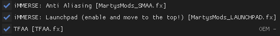
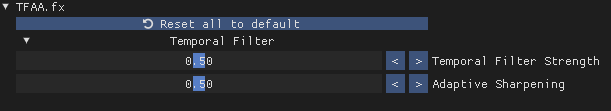

# Reshade TFAA
- This is a work in progress Reshade shader, which acts as an addon to other, non-temporal anti-aliasing methods.
- It adds a Temporal filter component similar to the ones found in SMAA (1Tx, Filmic SMAA T2x), TAAU, most otherwise unamed TAA implementations and even FSR2. 
- It requires Marty McFly's [LAUNCHPAD.fx](https://github.com/martymcmodding/iMMERSE/blob/main/Shaders/MartysMods_LAUNCHPAD.fx).

# Copyright Notice
 - Temporal Filter Anti-Aliasing | TFAA
 - First published 2022 - Copyright, Jakob Wapenhensch
 - License File [HERE](LICENSE)
 - https://creativecommons.org/licenses/by-nc/4.0/
 - https://creativecommons.org/licenses/by-nc/4.0/legalcode

# Example Shader Usage

  
# Updates
- 0.1 
  - Initial release; a lot of stuff was broken or not working at all.
- 0.2 
  - Variance clamping was implemented.
  - Finished implementing features present in the UI but did nothing at all in 0.1.
  - Fixed a lot of bugs.
  - Optimized some stuff.
- 1.0
  - New shader that is both simpler and looks cleaner, in my opinion.
  - Reworked most parts of the code in some way.
  - Removed some features that were never finished or not useful.
  - Made the UI much more user-friendly.
  - Added comments and docstrings to make it usable by other devs.
  - This effect is only one file now for convenience.
- 1.1
  - Reordered blending and clamping to be done in the order they are applied in all SOTA methods.
    - This dramatically improves the temporal stability of the effect, but also causes a bit more blur.
    - Reworked the adaptive sharpening to adjust more accurately to the temporal blur caused by the filter.
  - Readded dilated motion vector sampling.
    - This reduces artifacts around edges on moving objects.
  - Reduced samples used in the sharpening pass to enhance performance; you should not notice a difference.
- 1.1.1
  - Reworked the adaptive sharpening and blending weight calculation to use less magic numbers and be more intuitive and look cleaner.
  - Removed UI elements that were accidentally left in the shader.
- 1.1.2
  - Optimized performance. Now ~ 0.4ms in 4k on a RTX 2070. Before it was ~ 0.6ms.
  - Simplified some of the code to make future updates easier.
  - Fixed some bugs.

# Installation
- Install the current Reshade build.
- Drag everything into your Shaders folder.
- Do the same for https://github.com/martymcmodding/iMMERSE/blob/main/Shaders/MartysMods_LAUNCHPAD.fx.
- Order in Reshade should be ANTIALIASING (SMAA or! CMAA2 or! FXAA) -> LAUNCHPAD -> Any GI/AO/SSR Shaders -> TFAA -> COLOR CORRECTION -> ANYTHING ELSE

